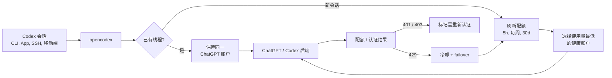

<h3 align="center">make codex open!</h3>
<p align="center"><b>粘贴一把 API Key，就拿到它能用的全部模型 —— 在 Codex、Claude Code、OpenCode 里。</b></p>
<p align="center"><code>ocxu connect</code> · <code>ocxu claude</code> · <code>ocxu opencode</code> · <b>localhost:10100</b></p>

<p align="center">
  <a href="https://github.com/Zhao73/opencodex-universal/actions/workflows/ci.yml"></a>
  <a href="https://github.com/Zhao73/opencodex-universal/blob/main/LICENSE"></a>
  
</p>

<p align="center">
  
</p>

<p align="center">
  <a href="README.md">English</a> · <a href="README.ko.md">한국어</a> · <b>简体中文</b> · <a href="README.ru.md">Русский</a> · <a href="README.ja.md">日本語</a> · 📖 <a href="docs-site/src/content/docs/zh-cn/"><b>文档源码 →</b></a>
</p>

> **Universal Gateway 预览分支。** 本仓库基于
> [lidge-jun/opencodex](https://github.com/lidge-jun/opencodex)，正在测试 One API、New API、
> Sub2API 多分组一键导入，以及 OpenCode 托管模型选择器。它已经使用独立包身份和不与旧版
> `ocx` 冲突的 `ocxu` 命令；在 npm 包正式发布前，预览版通过带 SHA-256 的 GitHub Release 分发。

```console
$ ocxu connect
Paste your API key (or the whole Base URL + key block), then press Enter on an empty line:
sk-··················
sk-··················

Found 2 keys: sk-cg-9f…8a63, sk-cg-1b…04d7
Probing gateways…

Connected 2 gateway(s):
  mallowapi-gpt
    endpoint  https://mallowapi.com/v1  [sub2api · responses]  rate ×0.2
    models    4 (openai)  default: gpt-5.6-sol
  mallowapi-grok
    endpoint  https://mallowapi.com/v1  [sub2api · chat-completions]  rate ×0.2
    models    6 (grok)  default: grok-4.5
```

一次粘贴：两把 key、两个模型家族、三个编码工具 —— 不写 manifest，不找 Base URL，不配环境变量。

<p align="center">
  
</p>

在 Codex 中 —— 以及在 **Claude Code** 中 —— 使用 Claude、Gemini、Grok、GLM、DeepSeek、Kimi、Qwen、Ollama 或任意其他 LLM，无需等待官方添加支持。

opencodex 是一个轻量级本地代理，把 Codex 的 Responses API 翻译成你的 provider 所讲的协议。streaming、tool 调用、reasoning token、图片 —— 全部双向工作。

<p align="center">
  
</p>
<p align="center"><sub><b>在 Codex 里运行任意模型。</b>选好 provider 即可 —— 同样的 Codex 工作流，不同的大脑。</sub></p>

它还能为 Codex 认证管理一个 **ChatGPT 账户池**。添加多个 ChatGPT / Codex 账户，在仪表盘中刷新它们的
5 小时 / 每周 / 30 天配额，并让新会话自动路由到使用量最低的健康账户。现有 Codex 线程会固定在启动它的
账户上，因此长时间的 SSH、tmux 或移动端连接的会话不会在对话中途切换账户。

```
Codex CLI / App / SDK ──/v1/responses──▶ opencodex ──▶ Any provider
                                              │
              Anthropic · Google · xAI · Kimi · Ollama Cloud · Groq
              OpenRouter · Azure · DeepSeek · GLM · …and OpenAI itself
```



## 支持平台

| 操作系统 | 状态 | 服务管理 |
|---|---|---|
| macOS (arm64 / x64) | 完整支持 | launchd |
| Linux (x64 / arm64) | 完整支持 | systemd（用户级） |
| Windows (x64 / arm64) | 已支持；x64 进入 CI 硬门槛 | Task Scheduler / 可选 WinSW 原生服务 |

需要 [Node](https://nodejs.org) 18+。安装器会自动选择匹配架构的 Bun，无需单独安装，Windows 不需要 WSL。每个预览产物都会先校验 SHA-256，再安装到 staging；升级时只有新启动器和原有后台服务都验证通过，旧版本才会被删除。

## 快速开始

### macOS（Apple Silicon / Intel）

```bash
version="0.1.0-preview.2"
artifact="opencodex-universal-${version}.tgz"
release="https://github.com/Zhao73/opencodex-universal/releases/download/v${version}"
installer="/tmp/opencodex-universal-install.sh"

curl -fsSL "https://raw.githubusercontent.com/Zhao73/opencodex-universal/v${version}/scripts/install.sh" -o "$installer"
sha256="$(curl -fsSL "${release}/${artifact}.sha256")"
OPENCODEX_PACKAGE_SPEC="${release}/${artifact}" \
OPENCODEX_PACKAGE_SHA256="$sha256" \
  bash "$installer"

ocxu init
ocxu start
```

### Windows（PowerShell 5.1+，x64 / arm64）

```powershell
$version = "0.1.0-preview.2"
$artifact = "opencodex-universal-$version.tgz"
$release = "https://github.com/Zhao73/opencodex-universal/releases/download/v$version"
$installer = Join-Path $env:TEMP "opencodex-universal-install.ps1"

Invoke-WebRequest -UseBasicParsing "https://raw.githubusercontent.com/Zhao73/opencodex-universal/v$version/scripts/install.ps1" -OutFile $installer
$sha256 = (Invoke-WebRequest -UseBasicParsing "$release/$artifact.sha256").Content.Trim()
& $installer -PackageSpec "$release/$artifact" -ExpectedSha256 $sha256

ocxu init
ocxu start
```

安装器默认写入用户目录，不需要管理员权限；`ocxu` 不会覆盖已有的上游 `ocx`。重复运行同一条命令会事务式升级。
本机检查使用 `bash install.sh check` 或 `.\install.ps1 -Action Check`。

## 亮点

- **粘一下就好。** `ocx connect` 接受裸 key、`Base URL` + key 整段、`curl` 片段、env export 或 JSON —— 自动识别网关（Sub2API / One API / New API / 通用），读取这把 key 真实可用的模型，并把每把 key 导入为独立 provider。一次粘多把 key 就能同时接入多个网关；重复粘贴则原地刷新。
- **在 Codex 中使用任意 LLM。** 5 种协议 adapter 覆盖 Anthropic Messages、Google Gemini、Azure、OpenAI Responses 直通，以及所有 OpenAI 兼容 Chat Completions 端点 —— 即开箱即用的 **40+ provider**。
- **在 Claude Code 中也能使用任意 LLM。** 同一个守护进程提供 Anthropic Messages API（`/v1/messages` + `count_tokens`）：`ocx claude` 启动完全接线的 Claude Code，路由模型通过网关模型发现出现在原生 `/model` 选择器中（`claude-ocx-<provider>--<model>` 别名，Claude Code 2.1.129+）。槽位和模型映射在仪表盘的 Claude 页面配置。
- **安全地池化 ChatGPT 账户。** 现有 Codex 线程保持在一个账户上，而新会话可以从池中自动挑选使用量更低的账户，并带有配额刷新和非 PII 请求标签。
- **登录一次，免填 API key。** xAI、Anthropic、Kimi 支持 OAuth，可用现有账户认证，token 自动刷新。也可以转发 `codex login`、粘贴 API key，或使用 `${ENV_VAR}` 引用 —— 随你选择。
- **Codex 在哪里能用，它就在哪里能用。** 自动注入 Codex CLI、TUI、App 和 SDK。路由模型像原生模型一样出现在 Codex 的模型选择器里。
- **委派给合适的模型。** 在仪表盘或 config 中把最多 5 个路由/原生模型放进 Codex 的 subagent 选择器 —— 复杂任务交给 reasoning 模型，快速任务交给便宜模型。在 v2 多智能体表面（GPT-5.6 Sol/Terra）上，代理会注入精简的委派指引：首选子智能体模型与 effort（`injectionModel` / `injectionEffort`）、featured 模型清单及各自支持的 effort 阶梯，以及让跨模型 `spawn_agent` 覆盖得以应用的 `fork_turns` 规则。已知限制：原生父代理 spawn 路由子代理时，任务正文可能以后端加密形式到达而丢失（[#92](https://github.com/lidge-jun/opencodex/issues/92)）—— 需要可靠的跨 provider 委派请使用 v1 表面。想自定义文案，可在 `injectionPrompt` 中使用 `{{model}}` / `{{effort}}` / `{{roster}}` 占位符。
- **为 preview-gated OpenAI rollout 做好准备。** GPT-5.6 Sol/Terra/Luna 保留 upstream effort 阶梯。Direct/Multi 使用 372k Codex 契约，OpenAI API 与 OpenRouter 使用 1.05M 元数据。
- **给任意模型超能力。** 非 OpenAI 模型也能通过你的 ChatGPT 登录上运行的 `gpt-5.4-mini` sidecar 获得真正的网页搜索和图片理解。
- **原生生成图片。** Codex 的独立 `image_gen` 工具通过 `POST /v1/images/generations` 生成图片、通过 `POST /v1/images/edits` 编辑图片；它独立于 hosted Responses 的 `image_generation` 工具。
- **看清正在发生什么。** Web 仪表盘展示 provider、OAuth 状态、模型选择和实时请求日志；当上游返回时，也会包含 cached/cache-write token 计数 —— 不必再猜测请求为何失败。
- **后台运行。** 安装为系统服务（launchd / systemd / Task Scheduler）后开机自启，无需操心。
- **干净退出，零残留。** `ocx stop`（或仪表盘的 Stop 按钮）会关闭代理、停止已安装的后台服务，并将 Codex 恢复为原始配置。之后 `codex` 就像从未安装过 opencodex 一样工作 —— 无残留配置，无僵尸进程。

## 一次粘贴，接入完成

`ocxu connect` 把「我有一把 key」到「编码工具里出现模型」压缩成一步。它默认从 **stdin** 读取，
key 不会进入 shell 历史：

```bash
ocxu connect                      # 粘贴后按一次空行回车
ocxu connect --file keys.txt      # 或从文件读取
pbpaste | ocxu connect            # 或直接管道剪贴板（macOS）
```

**能粘什么。** 服务商面板实际给你的那些格式，全都认：

| 粘贴内容 | 支持 |
|---|---|
| `sk-abc123` | ✅ 裸 key —— 端点自动探测 |
| `sk-abc123@https://gateway.example.com` | ✅ |
| `https://gateway.example.com/v1#sk-abc123` | ✅ |
| `Base URL: …` 与 `API Key: …` 分行 | ✅ |
| `export ANTHROPIC_BASE_URL=…` + `export ANTHROPIC_AUTH_TOKEN=…` | ✅ |
| `curl https://…/v1/chat/completions -H "Authorization: Bearer sk-…"` | ✅ |
| `{"base_url": "…", "api_key": "…"}`，以及它们的数组 | ✅ |
| 一次粘贴多把 key | ✅ 每把 key 成为独立 provider |

占位符（`${OPENAI_API_KEY}`、`your-api-key-here`、`sk-xxxx…`）会被有意忽略。

**它自动判断什么。**

1. **是哪家产品。** [Sub2API](https://github.com/Wei-Shaw/sub2api) 通过 `GET /v1/sub2api/billing`
   确认，同时拿到这把 key 的真实倍率，作为该连接的（仅用于估算的）`costMultiplier` 导入；
   One API / New API 通过 `/api/status` 识别；其余按通用 OpenAI 兼容端点处理。
2. **有哪些模型。** 带着你的 key 请求 `GET /v1/models`，拿到的就是这把 key **真实有权限**的清单，
   不是写死的列表。GPT 分组还会额外读取 Codex manifest（`/v1/models?client_version=…`），
   补齐显示名、推理档位（`low…max`）与 `priority` Fast 档。
3. **走哪个协议。** GPT 目录走 **Responses**（推理与 Fast 依赖它）；Claude、Grok、Gemini
   与混合目录走 **Chat Completions**。
4. **叫什么 provider id。** 由域名 + 模型家族推导 —— `mallowapi-gpt`、`mallowapi-claude`、
   `mallowapi-grok`。重复粘贴同一把 key 会**原地刷新**该连接，不会产生重复项，也绝不会覆盖
   无关的 provider。

**多把 key 并存。** 每把 key 都是独立 provider，各自的凭据、协议、模型与倍率互不干扰 ——
GPT key 永远不会被当成 Claude key 的兜底，两者同时在线：

```bash
ocxu connect --apply codex,opencode     # 导入后顺带配置好客户端
ocxu connect --dry-run                  # 只探测并打印，不写盘
ocxu connect --base-url https://my-one-api.internal --allow-private-network
ocxu connect --json                     # 机器可读输出（key 已脱敏）
```

仪表盘里是同一套流程：**`ocxu gui` → Providers → Import gateways → 粘贴 API Key**。

> **key 存到哪里。** 识别到的 key 保存在本地 `~/.opencodex/config.json`。粘贴内容里带了端点的，
> 就只发给那个端点；**裸 key** 必须逐个试已知地址（你的 `--base-url` → 配置里已有的网关 → 内置参考站），
> 所以 `connect` 会在发出第一个请求前把这份清单打印出来。只想探测自家网关就加 `--base-url`。
> CLI 输出、JSON 输出、管理 API 响应一律只回显脱敏形式（`sk-cg-9f…8a63`），原文永不回传。

## 添加 Provider

最简单的方式：用 Web 仪表盘。

```bash
ocxu gui
```

这会打开 `http://localhost:10100` 仪表盘。在这里：

1. 点击 **"Add Provider"**。
2. 从 **40+ 内置 provider** 中选择，或输入自定义的 OpenAI 兼容端点。
3. 粘贴 API key（Anthropic、xAI、Kimi 也可用 OAuth 登录）。
4. 模型会从 provider 的 `/v1/models` 端点**自动发现**。

新 provider 立即可用，无需重启。

你也可以通过 `ocx init`（交互式 CLI）或直接编辑 `~/.opencodex/config.json` 来添加 provider。

## 聚合网关分组与 OpenCode

`ocxu connect` 覆盖了绝大多数场景。当你需要更强的显式控制 —— 可分享的 manifest、用环境变量存凭据、
手工调校能力档案、或跑会计费的 preflight 探针 —— 完整的网关工作流依然在。

One API、New API、Sub2API 等 OpenAI 兼容聚合网关通常让每把 key 绑定不同模型分组。
把每个分组导入为独立 provider，避免把 GPT key 误当成 Grok key 的故障切换凭据：

```text
ocxu gui → 提供方 → 批量导入网关
```

前端可以在同一次操作中添加多个相互独立的端点：先统一校验全部连接，再运行不写入配置的
连接预检，最后原子化保存，不会留下“只导入成功一半”的配置。模型目录、最小推理和
Fast/priority 会分别报告；最小推理与 Fast 必须明确开启，因为它们可能产生上游费用。
凭据可选择本机保存、引用环境变量，或明确设置为无需密钥。

若需要可共享且不含密钥的 CLI 清单：

```bash
export GATEWAY_GPT_API_KEY="..."
export GATEWAY_GROK_API_KEY="..."

ocxu gateway import examples/gateways/multi-gateway-gpt-grok.json --dry-run
ocxu gateway preflight examples/gateways/multi-gateway-gpt-grok.json --json
# 可选、可能计费的真实测试：
ocxu gateway preflight examples/gateways/multi-gateway-gpt-grok.json --inference --fast
ocxu gateway import examples/gateways/multi-gateway-gpt-grok.json --sync
```

示例中的名字只是中立占位符，不依赖任何特定网关品牌。清单只保存环境变量名，不保存原始 key；
连接数量不限，并可按连接选择 `openai-chat` 或 `openai-responses`。Manifest v2 还可声明
每个模型的显示名、Token 限制、输入模态、推理档位和显式 `priority` Fast 能力；每条
连接还可独立设置仅用于显示估算的 `costMultiplier`（例如 GPT `0.3`、Grok `0.2`）。
它不会改变上游网关的真实计费，旧版 v1 清单继续兼容。

同一份路由模型目录也可以直接提供给 OpenCode：

```bash
ocxu opencode configure  # 写入 ~/.opencodex/hosts/opencode.json
ocxu opencode            # 刷新配置并启动 OpenCode
```

随后 OpenCode 的 `/models` 会显示 `opencodex/gateway-gpt/gpt-5.6-sol`、
`opencodex/gateway-grok/grok-4.5` 等模型。声明的 reasoning 档位会变成 variant；
v2 配置只有显式声明 `priority` 才显示 `fast`。Composite 也只有在全部成员支持时才继承
Fast。启动器只设置 `OPENCODE_CONFIG`，不会覆盖用户的全局或项目 OpenCode 配置。

完整清单结构、PowerShell 示例、安全边界和 Fast 行为见
[聚合网关与 OpenCode](docs-site/src/content/docs/zh-cn/guides/gateway-import.md)。

## 模型路由

通过 `provider/model` 格式指定路由模型，在 Codex 中直接使用：

```bash
# 通过 Anthropic 使用 Claude Opus
codex -m "anthropic/claude-opus-5" "解释这个 stack trace"

# 通过 Google 使用 Gemini
codex -m "google/gemini-3-pro" "为 auth.ts 写单元测试"

# 通过 Ollama Cloud 使用 GLM
codex -m "ollama-cloud/glm-5.2" "写一个 SQL migration"

# 通过 Ollama 使用本地模型
codex -m "ollama/llama3" "重构这个函数"
```

省略 `provider/` 前缀时，opencodex 会路由到默认 provider，或根据模型名模式自动匹配（例如 `claude-*`
路由到 Anthropic，`gpt-*` 路由到 OpenAI）。

路由模型也会出现在 **Codex App** 模型选择器中，并带有按模型的 reasoning effort 控制：

当前 Codex 构建在模型声明支持时可显示 `low`、`medium`、`high`、`xhigh`、`max` 和 `ultra` reasoning 控制。
除非 provider config 明确设置 alias，opencodex 会把 `xhigh` 与 `max` 保持为不同档位。`ultra` 与上游
Codex 语义一致：客户端启用最大 reasoning 并主动委派多智能体，实际请求会转换为 `max` 发送。
路由模型仅在 provider config 通过 `reasoningEfforts` 显式开启时才会广告 `ultra`。

GPT-5.6 Sol/Terra/Luna 已在 OpenAI API key 和 OpenRouter 预设中作为 rollout-ready 目录条目预置
（`gpt-5.6-sol`、`gpt-5.6-terra`、`gpt-5.6-luna`；OpenRouter 使用 `openai/...`）。
规格与 upstream models.json 快照一致 —— Sol/Terra 提供到 `ultra`，Luna 到 `max`，Sol 默认
reasoning 为 `low`。可用性仍受上游
preview gate 限制；opencodex 只是准备好你的账户/provider 可访问时所需的路由和目录元数据。

<p align="center">
  
</p>

## OpenAI provider 账户模式

| Provider ID | 路径 | 凭证 | 行为 |
|---|---|---|---|
| `openai` | Codex 登录 | 主账户 + 添加的 Codex 账户 | 默认 Pool，可选 Direct 模式 |
| `openai-apikey` | OpenAI API | API key/key pool | 不进行 Codex 账户路由 |

- Pool 包含主登录和添加的账户，并应用 affinity、配额、冷却和 failover。
- Direct 绕过池状态，只使用当前 caller/主登录 bearer。
- 新安装和未保存模式的配置默认使用 Pool。在仪表盘 **Providers** 中切换模式时，
  `gpt-5.6-sol` 等 bare 模型 id 保持不变。
- `openai-apikey/gpt-5.6-sol` 选择 API；Codex 登录与 API 凭证之间不会 fallback。
- 当前 marker 为 `openaiProviderTierVersion: 2`，原配置备份到
  `~/.opencodex/config.json.pre-openai-tiers-v2.bak`。恢复命令：
  `cp ~/.opencodex/config.json.pre-openai-tiers-v2.bak ~/.opencodex/config.json`
- 旧的 v1 三 provider 配置会自动迁移为单一 `openai` 行。
- API 层 GPT-5.6 元数据为 1,050,000 context / 922,000 max input。
  `gpt-5.6-sol-pro`、`terra-pro`、`luna-pro` 保留公开 virtual id，线上请求改写为 base id 加
  `reasoning.mode: "pro"`。

### Pool 账户行为

打开仪表盘中的 **Codex Auth** 来添加池账户，并选择由哪个账户处理下一个 Codex 会话。
opencodex 保持两种独立行为：

- **现有会话保持 affinity。** 线程 id 绑定到所选账户并在后续轮次复用，因此长请求或移动/SSH 连接的会话
  会继续使用同一账户。
- **新会话可自动路由。** 启用自动切换后，opencodex 比较 5 小时、每周、30 天使用量中最热的配额窗口，
  当活跃账户越过阈值时，为新会话挑选使用量更低的合格账户。
- **内置配额查询。** 仪表盘可一键刷新所有账户配额，请求日志用非 PII 的账户序号标记池流量。
- **失败即 fail-closed。** token 失败会标记需重新认证，而不是悄悄回退到另一个凭证；429 配额响应会让账户
  进入冷却，并可将后续工作 failover 到另一个合格的池账户。

## Provider 与 adapter

| Provider | Adapter | 认证方式 |
|---|---|---|
| OpenAI（ChatGPT 登录） | `openai-responses` | 转发（无需 key） |
| OpenAI（API key） | `openai-responses` | key |
| Umans AI Coding Plan | `anthropic` | key |
| Anthropic Claude | `anthropic` | oauth / key |
| xAI Grok | `openai-chat` | oauth / key |
| Kimi（Moonshot） | `openai-chat` | oauth / key |
| Google Gemini | `google` | key |
| Azure OpenAI | `azure-openai` | key |
| Ollama Cloud + 17 家 provider 目录 | `openai-chat` | key |
| Ollama / vLLM / LM Studio（本地） | `openai-chat` | key（通常留空） |
| 任意 OpenAI 兼容端点 | `openai-chat` | key |

此外还有 DeepSeek、Groq、OpenRouter、Together、Fireworks、Cerebras、Mistral、Hugging Face、NVIDIA NIM、MiniMax、Qwen Cloud、腾讯云 Coding Plan、SiliconFlow 等等。完整列表可通过 `ocx init` 查看，或参阅 [provider 文档](https://zhao73.github.io/opencodex-universal/zh-cn/reference/configuration/)。

## CLI

```bash
ocx connect                    # 粘贴 API key —— 自动识别网关并加载模型
ocx init                       # 交互式初始化
ocx start [--port 10100]       # 启动代理
ocx stop                       # 停止并恢复原生 Codex 配置
ocx restore                    # 仅恢复，不停止（别名：ocx eject）
ocx uninstall                  # 移除 service/shim/config 并恢复原生 Codex
ocx ensure                     # 按需启动 + 刷新 Codex config/cache
ocx sync                       # 刷新模型列表 + 重新注入 Codex
ocx status                     # 查看代理是否在运行
ocx login <xai|anthropic|kimi> # OAuth 登录
ocx logout <provider>          # 移除已保存的登录
ocx account <list|current|use> # 查看/切换账号与 API-key pool（脱敏；含 refresh/auto-switch/remove/add-key）
ocx gui                        # 打开 Web 仪表盘
ocx claude [args...]           # 启动接入代理的 Claude Code（模型发现已开启）
ocx codex-shim install         # 运行 codex 时自动启动代理
ocx service [install|start|stop|status|uninstall]   # 安装/更新/启动后台服务
ocx update [--tag preview]     # 更新 opencodex；preview 安装保持 @preview
```

### 自动启动：service vs shim

opencodex 提供两种自动启动代理的方式：

| | `ocx service` / `ocx service install` | `ocx codex-shim install` |
|---|---|---|
| **方式** | OS 服务管理器（launchd / systemd / schtasks） | 包装 `codex` 脚本启动器；不会改动真实 `codex.exe` |
| **时机** | 登录后始终运行 | 按需 — 仅在运行 `codex` 时启动 |
| **重启** | 崩溃后自动重启 | 每次调用 `codex` 时启动一次 |
| **Codex 更新** | 不受影响 | 稳定完成的启动器替换会在下一条普通 `ocx` 命令中修复 |
| **移除** | `ocx service uninstall` | `ocx codex-shim uninstall` |

如需常驻代理，使用 **service**（推荐开发环境）。轻量按需启动使用 **shim**。

如果外部 Codex 更新覆盖了已安装的 shim，下一条普通 `ocx` 命令会备份已稳定的新启动器并恢复
shim。仍在变化的启动器不会被改动，而会在后续命令中重试。修复失败只会警告，不会让请求的命令
失败；手动备用命令为 `ocx codex-shim install`。若要关闭自动恢复，请将
`codexShimAutoRestore` 设为 `false`，或为进程设置
`OPENCODEX_CODEX_SHIM_AUTO_RESTORE=0`。
如果配置的代理端口已被占用，`ocx start` 会自动选择另一个空闲本地端口并更新 Codex 使用它。

### 卸载

删除 npm 包之前，先清理本地状态：

```bash
ocx uninstall
npm uninstall -g opencodex-universal
```

`ocx uninstall` 会停止代理、移除已安装的 service、移除 Codex shim、恢复原生 Codex config/catalog/history，并删除 `~/.opencodex`。

## 配置

配置文件路径：`~/.opencodex/config.json`。

**云端 provider 示例：**

```json
{
  "port": 10100,
  "defaultProvider": "anthropic",
  "providers": {
    "anthropic": {
      "adapter": "anthropic",
      "baseUrl": "https://api.anthropic.com",
      "authMode": "oauth",
      "defaultModel": "claude-sonnet-4-6"
    },
    "ollama-cloud": {
      "adapter": "openai-chat",
      "baseUrl": "https://ollama.com/v1",
      "apiKey": "${OLLAMA_API_KEY}",
      "defaultModel": "glm-5.2"
    }
  }
}
```

provider 条目还可以标注路由目录元数据。`contextWindow` 设置 provider 级别、对 Codex 可见的上下文上限，
`modelContextWindows` 设置按模型的上限，`modelInputModalities` 设置按模型的目录输入提示，例如 `["text"]`
或 `["text", "image"]`。这些值只会对实时 `/models` 元数据设上限，绝不会抬高更小的实时上下文窗口。内置
GPT-5.6 Sol/Terra/Luna fallback 元数据会为 OpenAI API key 和 OpenRouter 目录条目使用 1,050,000 token 的
usable context window；它不会绕过上游 preview access。完整字段参阅配置参考。

> **通过 Z.AI 使用 GLM-5.2 1M 上下文：** 在 `openai-chat` adapter 下，`glm-5.2` 和 `glm-5.2[1m]` 都可用 ——
> opencodex 会在发送请求前剥离末尾的 `[1m]` 后缀，因为 OpenAI 兼容端点会拒绝带方括号的 id（Z.AI 400 code
> 1211）。`[1m]` 后缀是 Claude-Code / Anthropic 端点的约定；若要原生使用，请把 `anthropic` adapter 指向
> Z.AI 的 coding base（`https://api.z.ai/api/coding/paas/v4`）。1M 上下文窗口通过模型目录
> （`modelContextWindows`）设置，而不是模型名。

**本地 provider 示例（Ollama / vLLM / LM Studio）：**

```json
{
  "port": 10100,
  "defaultProvider": "local",
  "providers": {
    "local": {
      "adapter": "openai-chat",
      "baseUrl": "http://localhost:11434/v1",
      "apiKey": "",
      "defaultModel": "qwen3:32b"
    }
  }
}
```

本地 provider 的 `apiKey` 通常留空。只要你的本地服务暴露了 OpenAI 兼容的 Chat Completions 端点，opencodex 就能直接对接。

WebSocket 传输默认关闭。只有当你希望 Codex 使用 Responses WebSocket 而不是 HTTP/SSE 时，才需要设置 `"websockets": true`。

### 远程访问

默认情况下 opencodex 绑定到 `127.0.0.1`（回环）且无需额外认证。
如果你设置 `"hostname": "0.0.0.0"` 把代理暴露到局域网，opencodex 会要求一个 bearer token 来同时保护管理
API（`/api/*`）和数据平面（`/v1/responses`、`/v1/images/generations`、`/v1/images/edits`）：

```bash
export OPENCODEX_API_AUTH_TOKEN="your-secret-token"
ocx start
```

绑定到非回环地址时若缺少该环境变量，代理会拒绝启动。若为局域网访问安装后台服务，请在 `ocx service install`
之前于同一 shell 中导出相同变量，以便服务管理器接收到它。客户端（脚本、远程机器）必须在每个请求中带上 token：

```
x-opencodex-api-key: your-secret-token
```

token 以常量时间比较，以防止时序攻击。

opencodex 会自动 remap Codex resume 历史，使旧的 OpenAI 对话和 opencodex 创建的项目线程在代理活动期间仍在
Codex App 中可见。原始 provider/source 元数据记录在 `~/.opencodex/codex-history-backup.json`。`ocx stop` /
`ocx restore` 会把备份的 OpenAI 行恢复到 OpenAI，并把剩余的 opencodex 用户线程也 eject 到 OpenAI，这样原生
Codex 不会尝试 resume 一个其 provider 已不在 `config.toml` 中的线程。

如果你测试过备份支持出现之前的旧开发版本（`syncResumeHistory` 已经 remap 了历史），可以运行显式恢复命令：

```bash
ocx recover-history --legacy-openai
```

每个字段的详细说明参阅 **[配置参考](https://zhao73.github.io/opencodex-universal/zh-cn/reference/configuration/)**。

## 文档

完整文档——安装、provider 配置、路由、sidecar、Codex 集成、Codex App 模型选择器、CLI/配置参考——由 [`docs-site/`](./docs-site) 目录下的 Astro 站点构建；Pages 发布门槛启用后会部署到 **[zhao73.github.io/opencodex-universal](https://zhao73.github.io/opencodex-universal/zh-cn/)**。

维护者 source of truth 位于 [`structure/`](./structure)，历史调查和诊断笔记保留在 [`docs/`](./docs)。

## 开发

```bash
git clone https://github.com/Zhao73/opencodex-universal.git
cd opencodex-universal
bun install
bun run dev:proxy    # 以开发模式启动代理 API
bun run dev:gui      # 在另一个终端启动仪表盘 dev 服务器
bun x tsc --noEmit   # 类型检查
```

`bun run dev` 作为 `bun run dev:proxy` 的别名保留以兼容旧用法。在源码检出中，代理 API 暴露 `/healthz`、
`/v1/responses`、`POST /v1/images/generations`、`POST /v1/images/edits`、`/api/*`；只有在
`bun run build:gui` 生成 `gui/dist` 之后，`GET /` 才会提供打包后的仪表盘。开发前端时请单独运行：

```bash
bun run dev:gui
```

参阅 **[贡献指南](https://zhao73.github.io/opencodex-universal/zh-cn/contributing/)**。

## 免责声明

opencodex 是一个独立的社区维护项目，**与 OpenAI、Anthropic 或任何其他提供商无关，也未获得其认可。**

某些提供商——尤其是 Anthropic (Claude)——可能会对通过第三方代理路由 API 流量的账户进行暂停或限制。**使用风险自负 (UAYOR)。** 在连接提供商之前，请查阅其服务条款以确认是否允许基于代理的访问。opencodex 维护者不对上游提供商采取的任何账户操作承担责任。

## 许可证

MIT
